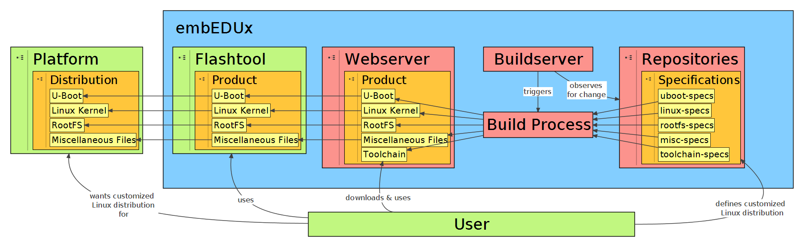

# The **embEDUx** Project
The *embEDUx* project aims to deliver a **solution for building and deploying customized
linux distributions for educational purposes**.

The origin lays at a university of applied sciences called
[HTWG Konstanz](http://www.htwg-konstanz.de/English.20.0.html) located in Constance,
Germany.  For the complete story have a look at the [the
beginning](background/background.md#The Beginning).

We are working on making the current state publicly available.  We will also
upload the build specification files that allow you to reproduce our builds!

#### Terminology
Before continuing, please make sure that you are familiar with the
[terminology](background/terminology.md). If you keep an open eye for
crudities, you are encouraged to inform us by either opening an issue or putting
up a pull-request.

## The Core
embEDUx is completely based on Open Source software. The biggest projects that
were chosen for the core of the solution are

* GNU Toolchain
* Crosstool-NG
* Gentoo Linux
* Buildbot
* Ansible
* Qemu
* Das U-Boot Bootloader
* Git

If you are interested in why these choice were made, please head over to the
[background section](background/background.md)

## Focus on Hardware
A variety from low up to high end ARM-boards were available during the design
and development of the project. Successful builds have been produced for

* Raspberry Pi
* Banana Pi
* Beaglebone Black
* Utilite Pro

While we were able build, deploy to and run systems on these platforms, this
project is not meant to provide the builds them self. Instead, you will find
instructions how to setup or use an existing instance of the build system in
order to produce you own customized builds.

## Building Customized Linux Distributions
The embEDUx build system been designed to build customized Linux distributions.
These systems consist of distinct products, namely

* Linux-Kernel
* Das U-Boot Bootloader
* Root Filesystem

and finally some miscellaneous files and a toolchain to support the build
process.

If you are not familiar with any of these terms, please consider reading through
the [terminology](background/terminology.md), and if necessary study other
subject related literature.

## Getting Started with ***your*** Distribution
The task of building a customized Linux distribution is rather complex, 
and the **embEDUx** tries to not take away flexibility with the provided
solution. Therefore, a good understanding of the matter is needed and it is
not possible to provide you with a static instruction list.

Like every software system, the very basic topics are about its setup and
its usage, here we go!

### Setup
If you already have access to a fully setup instance of the build system, you
can skip this chapter. Otherwise, please follow the [Setup
Instructions](setup/setup.md)

### Post Install
The post installation procedures will guide the Administrator through creating
toolchains and the user documentation. These are very important steps, because
the objects are required by the user to use the buildsystem.

* [Toolchains](setup/post-install/toolchains.md)
* [User Documentation](setup/post-install/user-documentation.md)

### Usage
The customized Linux distribution will consist of the aforementioned products,
of which you will have to build ***all*** in order to achieve ultimate glory
with a complete system for your target platform!

#### Overview
We strongly suggest that you have a look at the [usage
overview](usage/usage.md). The overview will give you an idea of how the process
of building a product looks like in a general sense.

#### Build
If you feel ready, please begin to **build your products**!

* [U-Boot](usage/uboot.md) images
* [Linux](usage/linux.md)-Kernel images and modules
* [RootFS](usage/rootfs.md)-archives based on Gentoo

Some platforms, e.g. the Raspberry Pi, require additional files that do not
strictly belong to any of the three products from above. These miscellaneous
files are stored in their very own repository which is handled separately.

* [Misc](usage/misc.md)-archives

#### Deploy
**embEDUx** ships a CLI-style [Flashtool](background/implementation/flashtool.md) for
easy deployment to your hardware!  More information and instructions for manual
deployment shall be found at the end of the [usage
overview](usage/usage.md#hardware-deployment)

