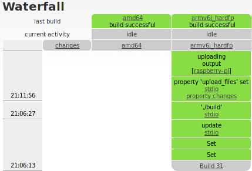

# Linux
To create a Linux kernel **embEDUx** needs at least a *kernel* branch and a
*platform* branch. The branches need to follow a certain name schema:

## Naming schema
* Kernel branch: \<kernel\_version> (eg. 3.17.2)
* Platform branch: \<kernel\_version>\_\<platform\_name\> (eg. 3.17.2_raspberry-pi)

**Importan: The platform\_name must not contain any underscores, use dashes
instead!**

## Kernel branch
The *kernel* branch will provide all the platform independent files, which are
the kernel sources, the **Gentoo** patches and the build script to patch and build
the kernel. Multiple platforms use the same *kernel* branch and therefore the
same kernel sources for the same kernel version. 

This [template](usage/linux/template/kernel_build) should be used as a build script. The
user only has to change the variables  *KERNEL_URL*, *KERNEL_FILE* and
*PATCH_VERSION* to fit to the desired kernel version. The *KERNEL_URL* and the
*KERNEL_FILE* can be obtained from [www.kernel.org](https://www.kernel.org/).
The *PATCH_VERSION* for the desired kernel version can be obtained from
[dev.gentoo.org](https://dev.gentoo.org/~mpagano/genpatches/tarballs/).

**Important: Because Gentoo patches are applied during build process, the user
has to make sure that the kernel version and the Gentoo patch version match to
each other. The *\<Major\>.\<Minor\>* version (eg. 3.17, 3.18, 3.19) is a common
base version for the Gentoo patches. The Gentoo patches don't strictly follow
the kernel version, which can lead to the situation, that Gentoo patches 3.18.8
result in the linux kernel version 3.18.7.**

These are the important lines, that need to be modified for each kernel version.
```bash
...
### Sources
KERNEL_URL="http://www.kernel.org/pub/linux/kernel/v3.x"
KERNEL_FILE="linux-<Major>.<Minor>.tar.gz"
...
PATCH_VERSION="<Major>.<Minor>-<Subminor>"
...
```

## Platform branch
The *platform* branch has to contain all platform dependent informations, which
are a valid kernel configuration and optional user patches. Furthermore it needs
to contain the build script named ***build***. This is a good
[template](usage/linux/template/platform_build) to start with.

With template, the only variables that have to be changed are *KERNEL\_VERSION*,
which should be the name of the *kernel* branch and the *KERNEL\_DTB*, which
should be the name of the desired device tree file.

**Important: The sources for the device tree file have to be present in the
kernel sources, or otherwise added by a user patch.**

These are the lines that need to be modified to fit to the *kernel* branch.
```
KERNEL_VERSION="<kernel_version>"
...
KERNEL_DTB="<platform_dtb>"
KERNEL_CONFIG=".config"
KERNEL_IMG="zImage"
...
```

### User patches
Any files that need to be added to the kernel sources before the build process need to be present as a patch in the root folder of the *platform* branch.

### Environment variables
With a local installed cross toolchain and an exising *kernel* branch in the
repository it is possible to test the *platform* build script locally. In order
to work, following environment variables need to be set.
* Target architecture:
  ARCH= (eg. 'arm')
* Path to the cross toolchain:
  CROSS_COMPILE= (eg.'armv6j-ctng-linux-gnueabi/bin/armv6j-ctng-linux-gnueabi-')
* Path where **embEDUx** should store its files:
  EMBEDUX_TMP= (eg. '/var/tmp/embedux/download/'

## Example 
In the following example a new 3.18.7 kernel and the raspberry-pi platform for
that kernel will be added to the *linux* repository. 

### Add new kernel
The following steps are necessary before you can [add](#add-new-platform) a
*plaform* for the desired kernel version to the repository.

1. Add a *kernel* branch named *\<Major\>.\<Minor\>.\<Subminor\>* to the *linux*
   repository. It is necessary that you push this initial branch, so **embEDUx**
   can start building your kernel after the last step.
   ```
   $ git checkout master
   $ git branch 3.18.7
   $ git checkout 3.18.7
   $ git touch README.md
   $ git add README.md
   $ git commit -m "inital commit"
   $ git push --set-upstream origin 3.18.7
   ```

1. Add the [template](template/kernel_build) as ***build*** to the repository
   and make it executable.
   ```
   $ ls -hl
   total 4.0K
   -rwxr-xr-x 1 user user 2.9K Mar  1 20:52 build
   -rw-r--r-- 1 user user    0 Mar  1 20:51 README
   ```

1. Modify *KERNEL\_URL*, *KERNEL\_FILE* and *PATCH\_VERSION* in the ***build***
   script, to match the desired kernel version.
   ```
   ...
   KERNEL_URL="http://www.kernel.org/pub/linux/kernel/v3.x"
   KERNEL_FILE="linux-3.18.tar.xz"
   ...
   PATCH_VERSION="3.18-9"
   ...
   ```

1. Add the changed files, commit and push. 
   ```
   $ git add build
   $ git commit -m "new kernel"
   $ git push 
   ```

The build script in the corresponding *platform* branch can now use the just
created *kernel* branch.

### Add new platform
This step requires an [existing](#add-new-kernel) *kernel* branch.

1. Add a *platform* branch named
   *\<Major\>.\<Minor\>.\<Subminor\>\_\<platform\>* to the *linux* repository.
   It is necessary that you push this initial branch, so **embEDUx** can start
   building your kernel after the last step.
   ```
   $ git checkout master
   $ git branch 3.18.7_raspberry-pi
   $ git checkout 3.18.7_raspberry-pi
   $ git touch README.md
   $ git add README.md
   $ git commit -m "inital commit"
   $ git push --set-upstream origin 3.18.7_raspberry-pi
   ```

1. Add the [template](template/platform_build) as ***build*** to the repository
   and make it executable. 
   ```
   $ ls -hl
   total 4.0K
   -rwxr-xr-x 1 user user 2.9K Mar  1 21:20 build
   -rw-r--r-- 1 user user    0 Mar  1 21:19 README
   ```

1. Modify *KERNEL\_VERSION* in ***build*** to the desired version, which is also
   the name of the *kernel* branch. Finally modify *KERNEL\_DTB* to the desired
   device tree blobs name and make sure the device tree sources do exist in the
   kernel sources.
   ```
   KERNEL_VERSION="3.18.7"
   ...
   KERNEL_DTB="bcm2835-rpi-b.dtb"
   KERNEL_CONFIG=".config"
   KERNEL_IMG="zImage"
   ...
   ```

1. Add a working kernel configuration ***.config*** to the repository.
   ```
   $ ls -hla
   total 76K
   drwxr-xr-x 1 user user  44 Mar  1 21:29 .
   drwxr-xr-x 1 user user 650 Mar  1 15:04 ..
   -rwxr-xr-x 1 user user 562 Mar  1 21:25 build
   -rw-r--r-- 1 user user 69K Mar  1 21:29 .config
   drwxr-xr-x 1 user user 188 Mar  1 21:29 .git
   -rw-r--r-- 1 user user   0 Mar  1 20:51 README 
   ```

1. Optional: Add needed patches to the repository.
   ```
   $ ls -hl
   total 8.0K
   -rw-r--r-- 1 user user 2.8K Mar  1 21:38 9000-Smsc95xx_allow_mac_to_be_set.patch
   -rwxr-xr-x 1 user user  562 Mar  1 21:25 build
   -rw-r--r-- 1 user user    0 Mar  1 20:51 README
   ```

1. Add all files, commit  and push branch upstream.
   ```
   $ git add build
   $ git add .config
   $ git add \*.patch
   $ git commit -m "new platform"
   $ git push
   ```

1. The **buildbot** should start building your kernel now. You can follow the
   build process on the **buildbot** website.
   

1. Congratulations, you just built your first kernel for your first platform.
   You can use the [flashtool](usage/flashtool/README.md) to flash the kernel image
   to your platform device.

